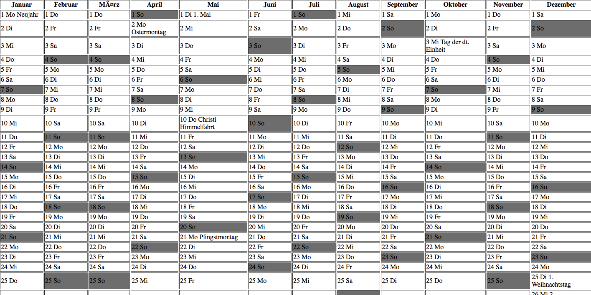

# German Version of year calendar

German actual year calendar with all bank holidays with using date/time functions.
To see the live version of the app, open the rainbow.php file on your localhost, for example using XAMPP.

